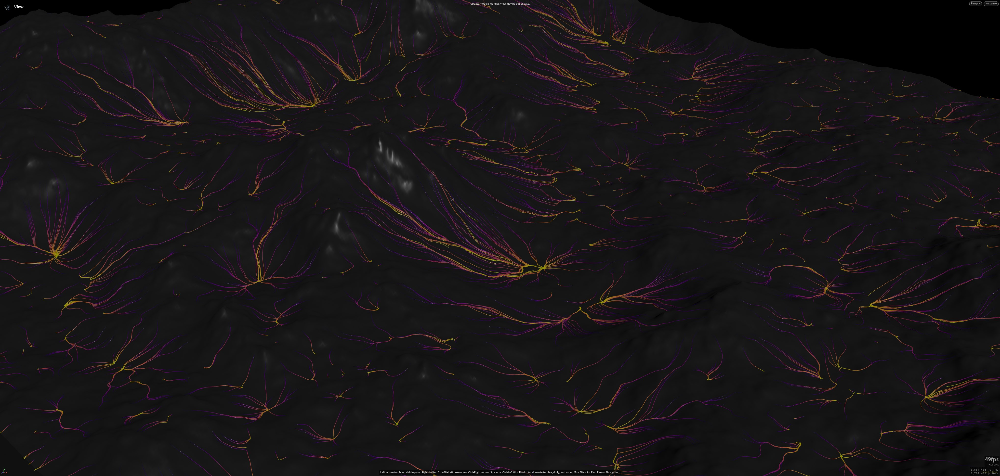
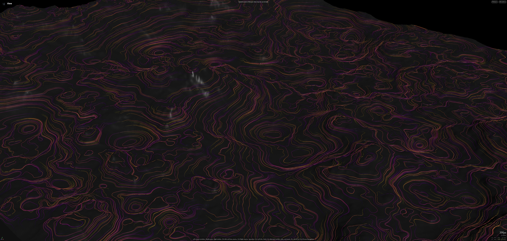

# Procedural Tools

Collection of procedural tools for procedural content generation.

## Contents

### OTLS/HDAs

- **HeightLines_HDA**  
  Generates vertical landscape-following curves based on terrain gradient, suitable for terrain feature visualization and stylization.  
  

- **HorizonLines_HDA**  
  Produces horizontal landscape-following curves by integrating perpendicular to the terrain gradient, creating horizon-aligned guides.  
  

---

## License

These tools and HDAs are provided for demonstrative purposes.

- Personal, non-commercial use is permitted. Credit is appreciated but not required.  
- Commercial use is allowed. Crediting the author is preferred as good community practice, but not enforced.  
- These assets are provided as blackbox; modification or internal inspection is not permitted without explicit permission.  
- For access to the unlocked HDAs and implementation code, please contact the author directly.
